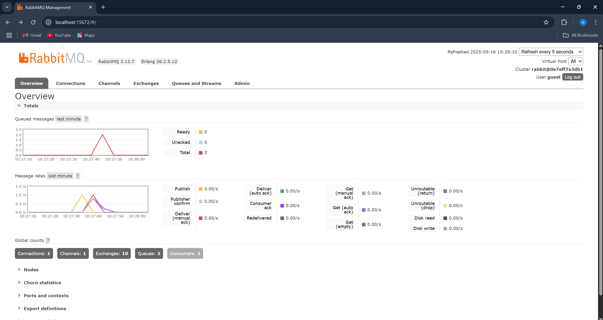

Advance Programming
# Module 9 - Software Architectures (Subscriber) 📘

- Nama    : Akhyar Rasyid Asy syifa
- Kelas   : Advance Programming - A
- NPM     : 2306241682

## Reflection
### a. What is amqp?

AMQP (Advanced Message Queuing Protocol) adalah protokol komunikasi berbasis pesan (message-oriented middleware) yang digunakan untuk mengirim data antar sistem terdistribusi. Protokol ini umum digunakan dalam sistem antrean pesan seperti RabbitMQ, karena mampu menjamin pertukaran pesan yang andal dan memisahkan peran antara pengirim dan penerima dalam arsitektur sistem.

### b. What does it mean? guest:guest@localhost:5672 , what is the first guest, and what is the second guest, and what is localhost:5672 is for?

Bagian `guest:guest` merupakan kredensial default untuk proses _authentication_ / login ke RabbitMQ. `guest` pertama sebelum tanda ":" adalah username, dan `guest` kedua setelah tanda ":" adalah password. Sementara `localhost:5672` menunjukkan alamat server (localhost) dan port default (5672) tempat RabbitMQ berjalan dan menerima koneksi melalui protokol AMQP.

### Simulation Slow Subscriber

pada grafik Queued message, terlihat disana mencapai ~21 karena saya menjalankan 5x cargo run publisher secara cepat, sementara subscriber berjalan lambat (slow subscriber). Karena ada delay `(thread::sleep)` di handler subscriber, pesan tidak langsung dikonsumsi, sehingga terjadi penumpukan pesan. setelah beberapa waktu delay yang di setting, subscriber mulai memproses atau acknowledge pesan tersebut hingga antrian kosong (0)